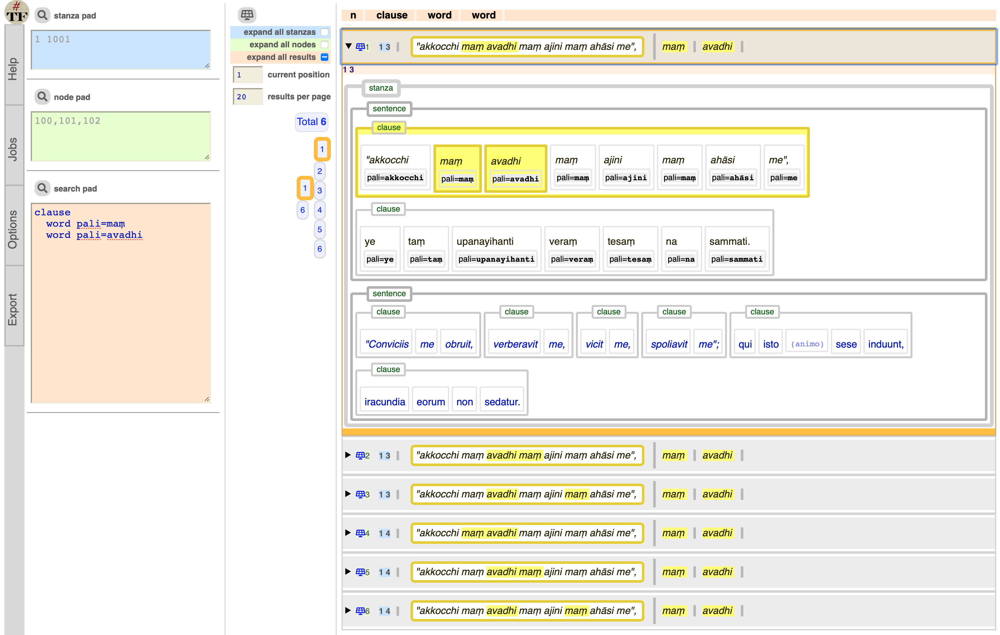
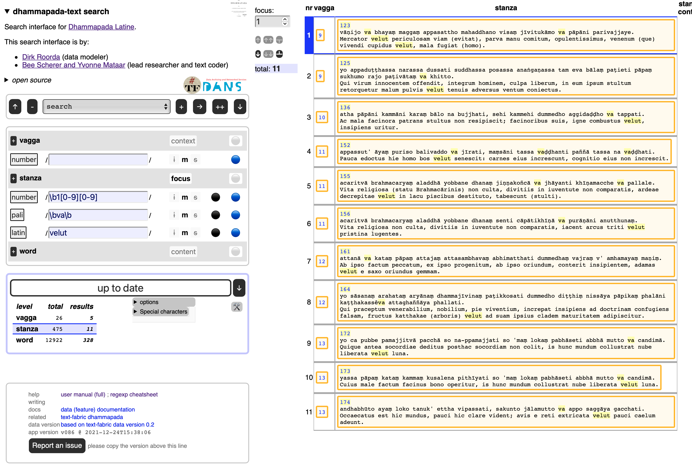

# Dhammapada-Latine

This is a
[Text-Fabric](https://github.com/annotation/text-fabric) app
for working with the
[Dhammapada](https://github.com/etcbc/dhammapada/) corpus.

Get started with the
[tutorial](https://nbviewer.jupyter.org/github/annotation/tutorials/blob/master/dhammapada/start.ipynb).

There is also a search interface for the BHSA.
It is online, but it works on your computer, in the browser.

Just click
[dhammapada-search](https://annotation.github.io/app-dhammapada/)
and off you go.

# Author

[Dirk Roorda](https://github.com/dirkroorda)

